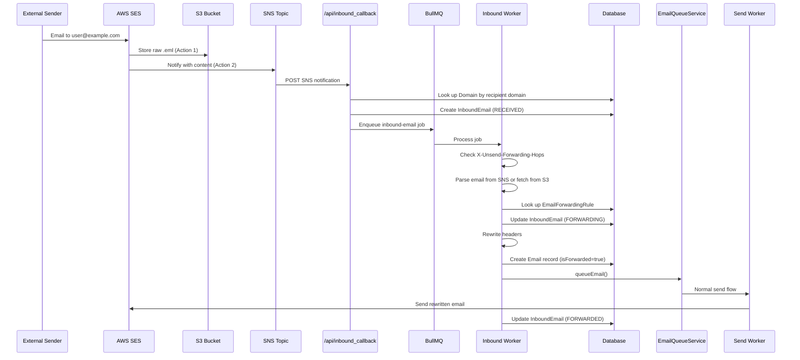

# Email Forwarding - Design Document

**Issue:** [#113 - Feat: Add email forwarding](https://github.com/usesend/useSend/issues/113)
**Date:** 2026-02-25
**Status:** Ready for Implementation

---

## Overview

Add inbound email forwarding to Unsend. Users configure per-address forwarding rules on their verified domains (e.g. `support@example.com` -> `team@company.com`). When an email arrives at the source address, Unsend forwards it to the configured destination.

### Goals

- Per-address forwarding rules (not catch-all) for the MVP
- Email-to-email forwarding only (no webhook/JSON delivery in MVP)
- Works for both cloud and self-hosted deployments

### Non-Goals (MVP)

- Catch-all / domain-level forwarding
- Webhook delivery of inbound email as JSON
- Attachment stripping or content transformation
- Spam filtering or content scanning

---

## Architecture

### Approach: SES Receipt Rules + SNS (Hybrid with S3 Fallback)

SES receives inbound email for verified domains. A Receipt Rule is provisioned with two actions:

1. **S3 action** (runs first) -- stores the raw `.eml` in an S3 bucket, ensuring the full email is persisted before processing begins.
2. **SNS action** (runs second) -- sends an SNS notification containing the email content inline (up to 150KB).

For most emails (under 150KB), the worker parses directly from the SNS payload. For larger emails, the worker fetches the raw message from S3. This gives the simplicity of SNS for common cases while handling large emails reliably.

### Data Flow

```
External Sender
  │
  ▼
AWS SES Receiving (Receipt Rule)
  ├──► S3: Store raw email (Action 1)
  └──► SNS: Notify with content (Action 2)
         │
         ▼
  POST /api/inbound_callback
         │
         ▼
  BullMQ "inbound-email" queue
         │
         ▼
  Inbound Worker
    1. Check X-Unsend-Forwarding-Hops header; drop if > 3 (loop prevention)
    2. Parse email from SNS payload (or fetch from S3 if truncated)
    3. Look up EmailForwardingRule by to-address + domain
    4. Rewrite headers for deliverability (increment hop counter)
    5. Send via SES to destination address (counts against sending limits)
    6. Update InboundEmail status
    Note: Bounces from forwarded emails skip the suppression list
```

### Header Rewriting

Forwarded emails must pass SPF/DKIM for the sending domain. The original sender's domain can't be used as `From` since Unsend doesn't control its DKIM. Headers are rewritten as:

| Header | Value |
|--------|-------|
| `From` | `"Original Sender via Unsend" <support@example.com>` (uses the source address from the forwarding rule) |
| `Reply-To` | Original sender's address |
| `Subject` | Preserved as-is |
| `X-Original-From` | Original sender's full address |
| `X-Unsend-Forwarding-Hops` | Incremented on each forward (for loop detection; max 3) |

### DNS Requirements

When inbound is enabled on a domain, users must add an MX record:

| Type | Name | Content | Priority |
|------|------|---------|----------|
| MX | example.com | `inbound-smtp.{region}.amazonaws.com` | 10 |

This is displayed in the UI alongside existing DNS records when the inbound toggle is enabled.

### Region Constraints

SES email receiving is available in: `us-east-1`, `us-west-2`, `eu-west-1`. Enabling inbound on a domain in any other region (e.g. `ap-southeast-1`) is **blocked with a clear error message**. The `enableInbound` mutation validates `domain.region` against the allowed list and rejects with: "Inbound email receiving is not available in {region}. Use a domain in us-east-1, us-west-2, or eu-west-1."

### Receipt Rule Limits

AWS SES allows a maximum of 200 receipt rules per rule set and 1 active rule set per AWS account. Since one rule is created per inbound-enabled domain, this caps the system at **200 inbound-enabled domains per AWS account**. This is acceptable for MVP. If the limit becomes a constraint, options include requesting an AWS limit increase or switching to a single wildcard receipt rule with application-level routing.

### Forwarding Loop Prevention

Forwarded emails include an `X-Unsend-Forwarding-Hops` header that is incremented on each forward. The inbound worker checks this header and **drops the email if the hop count exceeds 3**, preventing infinite loops between two Unsend users who forward to each other. The dropped email is logged as an `InboundEmail` with status `FAILED` and error message "Forwarding loop detected".

---

## Data Model

### New Models

```prisma
model EmailForwardingRule {
  id                 String   @id @default(cuid())
  teamId             Int
  domainId           Int
  sourceAddress      String   // local part only, e.g. "support"
  destinationAddress String   // full email, e.g. "team@company.com"
  enabled            Boolean  @default(true)
  createdAt          DateTime @default(now())
  updatedAt          DateTime @updatedAt

  team   Team   @relation(fields: [teamId], references: [id])
  domain Domain @relation(fields: [domainId], references: [id], onDelete: Cascade)

  @@unique([domainId, sourceAddress])
}

model InboundEmail {
  id               String             @id @default(cuid())
  teamId           Int
  domainId         Int
  forwardingRuleId String?
  from             String
  to               String
  subject          String?
  receivedAt       DateTime           @default(now())
  status           InboundEmailStatus @default(RECEIVED)
  s3Key            String?
  errorMessage     String?
  createdAt        DateTime           @default(now())
  updatedAt        DateTime           @updatedAt

  team           Team                 @relation(fields: [teamId], references: [id])
  domain         Domain               @relation(fields: [domainId], references: [id])
  forwardingRule EmailForwardingRule?  @relation(fields: [forwardingRuleId], references: [id])
}

enum InboundEmailStatus {
  RECEIVED
  FORWARDING
  FORWARDED
  FAILED
  NO_RULE
}
```

### Domain Model Additions

```prisma
// Added to existing Domain model:
inboundEnabled     Boolean  @default(false)
sesReceiptRuleId   String?
forwardingRules    EmailForwardingRule[]
inboundEmails      InboundEmail[]
```

### Email Model Additions

```prisma
// Added to existing Email model:
isForwarded        Boolean  @default(false)
```

The `isForwarded` flag allows `ses-hook-parser` to identify forwarded emails and skip suppression list additions when they bounce.

### Key Constraints

- `@@unique([domainId, sourceAddress])` -- one rule per source address per domain
- `onDelete: Cascade` on domain relation -- deleting a domain removes all its forwarding rules
- `sourceAddress` stores only the local part (before the @); the domain is derived from the relation

---

## API Layer

### TRPC Router: `forwarding`

New sub-router added to `apps/web/src/server/api/root.ts`:

| Procedure | Type | Description |
|-----------|------|-------------|
| `forwarding.listRules` | query | List all forwarding rules for a domain |
| `forwarding.createRule` | mutation | Create a forwarding rule (sourceAddress + destinationAddress) |
| `forwarding.updateRule` | mutation | Update destination or toggle enabled |
| `forwarding.deleteRule` | mutation | Delete a forwarding rule |
| `forwarding.enableInbound` | mutation | Enable inbound on a domain; provisions SES Receipt Rule |
| `forwarding.disableInbound` | mutation | Disable inbound on a domain; tears down SES Receipt Rule |
| `forwarding.listInboundEmails` | query | Paginated list of inbound emails for a domain |

All procedures use `teamProcedure`. Rule-specific procedures validate ownership via domain membership.

### REST API (Public)

Scoped under domains at `/api/v1/`:

| Method | Path | Description |
|--------|------|-------------|
| `GET` | `/v1/domains/:id/forwarding-rules` | List rules |
| `POST` | `/v1/domains/:id/forwarding-rules` | Create rule |
| `DELETE` | `/v1/domains/:id/forwarding-rules/:ruleId` | Delete rule |
| `PUT` | `/v1/domains/:id/inbound` | Enable/disable inbound |

### Callback Route

| Method | Path | Description |
|--------|------|-------------|
| `POST` | `/api/inbound_callback` | SNS notification endpoint for inbound emails |

Follows the same pattern as `/api/ses_callback`: validates SNS message, extracts email content or S3 key, enqueues to BullMQ. Handles SNS `SubscriptionConfirmation` messages inline by fetching the `SubscribeURL` and validating `TopicArn` against the `INBOUND_SNS_TOPIC_ARN` env var. No separate model is needed -- subscription confirmation is a one-time setup event.

### Validation Rules

- `sourceAddress` must belong to a verified domain (`status: SUCCESS`) owned by the team
- `destinationAddress` must be a syntactically valid email (no domain ownership restriction)
- One forwarding rule per source address per domain (enforced by unique constraint)
- Inbound can only be enabled on domains with `status: SUCCESS`
- Inbound can only be enabled on domains in a receiving-capable region (`us-east-1`, `us-west-2`, `eu-west-1`); other regions are rejected with a clear error

---

## Infrastructure

### New AWS Resources

| Resource | Purpose |
|----------|---------|
| S3 Bucket | Store raw inbound emails (fallback for messages > 150KB). Configured with a **30-day lifecycle rule** to auto-delete expired objects. |
| SNS Topic | Receive SES inbound notifications, forward to callback endpoint |
| SES Receipt Rule Set | Container for per-domain receipt rules (max 200 rules per set) |
| SES Receipt Rules | Created/destroyed dynamically per domain |

### New BullMQ Queues

| Queue | Concurrency | Purpose |
|-------|-------------|---------|
| `inbound-email` | 25 | Process inbound emails (parse, lookup rule, rewrite, forward) |
| `inbound-email-cleanup` | 1 | Scheduled job to delete InboundEmail records older than 30 days |

Both follow the existing `createWorkerHandler()` pattern used by `ses-webhook` and `webhook-dispatch`. The cleanup job runs daily via a repeatable BullMQ job.

### Configuration (Environment Variables)

| Variable | Description |
|----------|-------------|
| `INBOUND_S3_BUCKET` | S3 bucket name for raw inbound emails |
| `INBOUND_SNS_TOPIC_ARN` | SNS topic ARN for inbound notifications |
| `INBOUND_SES_RULE_SET` | SES Receipt Rule Set name |

---

## UI

The UI lives within the domain detail page at `/domains/[domainId]`. The existing flat layout is restructured into tabs using the `Tabs` component from `@usesend/ui/src/tabs`:

- **Overview** tab -- existing DNS records table and Settings (no content changes)
- **Forwarding** tab -- new forwarding UI

All components use the design system defined in `.cursor/rules/design-system.mdc`. Key constraints:
- Colors must use CSS variable tokens (`green`, `red`, `blue`, `yellow`, `gray`) -- never Tailwind defaults like `blue-500`
- Form labels use the `Label` component from `@usesend/ui/src/label`
- Switches use `data-[state=checked]:bg-success` for the green on-state
- Cards follow the `border rounded-lg p-4 shadow` pattern
- Dialogs use the standard `Dialog`/`DialogContent`/`DialogHeader`/`DialogFooter` structure

### Forwarding Tab Sections

**1. Inbound email receiving card**
- Toggle switch to enable/disable inbound (Switch with `data-[state=checked]:bg-success`)
- When enabled, displays the required MX record in the same `Table` format as the Overview DNS records, with `TextWithCopyButton` for name and content values

**2. Forwarding rules table**
- Columns: Source Address, Destination, Status (active/paused badge), Created, Actions (toggle + delete)
- Status badges use design system colors: active = `bg-green/15 text-green border border-green/25`, paused = `bg-gray/10 text-gray border border-gray/20`
- "Add rule" button (Button with Plus icon, `size="sm"`) disabled when inbound is off
- Delete button uses `variant="ghost"` with `text-destructive`
- Empty state: centered `text-muted-foreground text-sm` message

**3. Add rule dialog**
- Source address: `Input` with `rounded-r-none` + visual `@domain.com` addon in `bg-muted` box
- Destination address: `Input` with `type="email"`
- Labels use `Label` component from the design system
- Footer: outline Cancel button + primary Add rule button

**4. Inbound email log (collapsible)**
- Collapsible header with `ChevronDown`/`ChevronUp` icons from lucide-react
- Columns: From, To, Subject, Status, Received
- Status badges use design system color tokens:
  - received: `bg-blue/15 text-blue border border-blue/25`
  - forwarding: `bg-yellow/20 text-yellow border border-yellow/10`
  - forwarded: `bg-green/15 text-green border border-green/25`
  - failed: `bg-red/10 text-red border border-red/10`
  - no rule: `bg-gray/10 text-gray border border-gray/20`

### Prototype

- Code: `apps/web/src/app/(dashboard)/domains/[domainId]/forwarding-tab.tsx`
- All data is mock/local state for UI review purposes

---

## Error Handling

| Scenario | Behavior |
|----------|----------|
| No matching forwarding rule | InboundEmail created with status `NO_RULE`; email is dropped |
| Forwarding rule disabled | Same as no rule -- status `NO_RULE` |
| SES send failure | InboundEmail status set to `FAILED` with error message; retry via queue |
| S3 fetch failure | Retry with backoff; fail after max attempts |
| SNS payload truncated, S3 unavailable | InboundEmail status `FAILED`; logged for debugging |
| Domain inbound disabled | SES Receipt Rule torn down; SES stops receiving for that domain |
| Forwarded email bounces | Bounce is processed normally but **suppression list is skipped** for forwarded emails. The destination address is not added to the suppression list. |
| Forwarding loop detected | Email dropped if `X-Unsend-Forwarding-Hops` exceeds 3. InboundEmail status `FAILED` with error "Forwarding loop detected". |
| Domain verification fails while inbound is enabled | UI shows a **warning banner** on the Forwarding tab indicating verification has failed. Inbound is not auto-disabled; user must fix DNS or manually disable. |
| Enable inbound on non-receiving region | Mutation rejected with error: "Inbound email receiving is not available in {region}." |

---

## Edge Cases & Operational Decisions

Decisions made during design review, with rationale.

### 1. Forwarding bounce suppression -- skip entirely

When a forwarded email bounces at the destination, the existing `ses-hook-parser` normally adds the bounced address to the team's suppression list. For forwarded emails, **suppression is skipped entirely**. Without this, a single bounce would silently break all future forwards to that destination. The worker marks the forwarded `Email` record with an `isForwarded` flag so `ses-hook-parser` can identify and skip suppression for these emails.

### 2. Forwarded emails count against sending limits

Forwarded emails are sent via SES and trigger `SENT` events that increment `DailyEmailUsage.sent`. They **count against the team's daily sending quota**. This is the simplest approach and avoids creating a loophole for unlimited sending. Users should be aware that high-volume forwarding addresses consume quota.

### 3. Domain deletion Receipt Rule cleanup -- deferred

When a domain with `inboundEnabled: true` is deleted, the SES Receipt Rule is **not automatically cleaned up** in the MVP. This may leave orphaned Receipt Rules in AWS. This will be addressed in a future iteration by adding Receipt Rule teardown to the `deleteDomain` flow.

### 4. Verification failure warning

If a domain's DNS verification fails after inbound is enabled, the UI shows a **warning banner** on the Forwarding tab. Inbound is not auto-disabled -- the user retains control to fix DNS or manually disable forwarding. This avoids making AWS API calls in the read path and prevents flaky DNS checks from toggling inbound state.

### 5. Region validation -- block non-receiving regions

The `enableInbound` mutation validates that `domain.region` is one of `us-east-1`, `us-west-2`, or `eu-west-1`. Other regions are **rejected with a clear error message**. No auto-mapping is attempted. This keeps the implementation simple and avoids cross-region SES complexity.

### 6. Receipt Rule limit -- accept 200 cap

The 200 receipt rules per AWS account limit is **accepted and documented**. At MVP scale this is not a constraint. If it becomes one, the system can migrate to a single wildcard rule with application-level routing.

### 7. SNS subscription confirmation -- inline handling

The `/api/inbound_callback` endpoint handles SNS `SubscriptionConfirmation` messages by fetching the `SubscribeURL` and validating `TopicArn` against `INBOUND_SNS_TOPIC_ARN`. **No database model is needed** -- this is a one-time setup event.

### 8. Plan gating -- available to all plans

Email forwarding is **available to all plans** (FREE and BASIC) with no rule count limits. This maximizes adoption and feedback. Plan-based gating can be added later if needed.

### 9. S3 lifecycle -- 30-day auto-delete

The S3 bucket for raw inbound emails is configured with a **30-day lifecycle rule**. Objects are automatically deleted after 30 days. This prevents unbounded storage growth. Failed forwards that need retry must be retried within this window.

### 10. InboundEmail table cleanup -- background job

A scheduled BullMQ job (`inbound-email-cleanup`) runs daily and **deletes InboundEmail records older than 30 days**. This keeps the table manageable and aligns with the S3 retention window. The cleanup job follows the existing `webhook-cleanup` queue pattern.

### 11. Forwarding loop prevention -- hop counter

Forwarded emails include an `X-Unsend-Forwarding-Hops` header incremented on each forward. The inbound worker **drops emails with a hop count exceeding 3**. This prevents infinite loops between two Unsend users who forward to each other. The dropped email is recorded as `FAILED` with error "Forwarding loop detected".

---

## Implementation Decisions

Decisions resolved during implementation planning.

### 12. Sending path -- existing Email pipeline

Forwarded emails go through the existing Email pipeline. The inbound worker creates an `Email` record with `isForwarded: true`, then queues via `EmailQueueService.queueEmail()`. The normal send worker handles the actual SES delivery. Bounce tracking, daily usage counting, and event handling work automatically through the existing infrastructure.

### 13. Callback resolution -- resolve before enqueueing

`/api/inbound_callback` resolves domain/team context before enqueueing to BullMQ. It parses the recipient address, looks up the `Domain` record, creates an `InboundEmail` record with status `RECEIVED`, then enqueues with `{ inboundEmailId, teamId, domainId, snsMessage, s3Key }`. If the domain is not found or inbound is disabled, the callback returns 200 and silently drops the email.

### 14. Infrastructure provisioning -- manual one-time setup

S3 bucket, SNS topic, and SES Receipt Rule Set are manually provisioned one-time (like the existing outbound SNS/SES configuration). Only SES Receipt Rules are created/destroyed dynamically per domain via the `enableInbound`/`disableInbound` mutations.

### 15. From address -- source address from forwarding rule

The rewritten `From` header uses the source address from the forwarding rule. E.g., if the rule is `support@example.com -> team@company.com`, the From becomes `"Original Sender via Unsend" <support@example.com>`. This ensures the forwarded email is sent from an address on the user's verified domain.

### 16. SES API version -- v1 for Receipt Rules

SES Receipt Rules are only available in the SES v1 API (`@aws-sdk/client-ses`), separate from the existing `@aws-sdk/client-sesv2` used for sending. A new dependency is required.

---

## Implementation Plan

### Detailed Data Flow



### Phase 1: Schema & Environment

**1a. Prisma Schema Changes**

File: `apps/web/prisma/schema.prisma`

- Add to `Domain` model: `inboundEnabled Boolean @default(false)`, `sesReceiptRuleId String?`, relations to `EmailForwardingRule[]` and `InboundEmail[]`
- Add to `Email` model: `isForwarded Boolean @default(false)`
- Create `EmailForwardingRule` model with `@@unique([domainId, sourceAddress])`
- Create `InboundEmail` model with `InboundEmailStatus` enum (`RECEIVED`, `FORWARDING`, `FORWARDED`, `FAILED`, `NO_RULE`)

**1b. Environment Variables**

File: `apps/web/src/env.js`

Add three new optional server env vars (optional so existing deployments don't break):

- `INBOUND_S3_BUCKET` -- S3 bucket name for raw inbound emails
- `INBOUND_SNS_TOPIC_ARN` -- SNS topic ARN for inbound notifications
- `INBOUND_SES_RULE_SET` -- SES Receipt Rule Set name

### Phase 2: AWS Infrastructure Layer

**2a. New dependency**

Add `@aws-sdk/client-ses` (v1) to `apps/web`. The existing `@aws-sdk/client-sesv2` does not support Receipt Rules. Also add `@aws-sdk/client-s3` if not already present.

**2b. SES Receipt Rule service**

New file: `apps/web/src/server/aws/ses-receipt-rules.ts`

Functions:

- `createReceiptRule(domainName, region, ruleSetName, snsTopicArn, s3Bucket)` -- Creates a Receipt Rule with S3 + SNS actions for the domain
- `deleteReceiptRule(ruleName, region, ruleSetName)` -- Deletes a Receipt Rule
- Uses the same credential pattern as existing `apps/web/src/server/aws/ses.ts` (AWS_ACCESS_KEY / AWS_SECRET_KEY)

**2c. S3 client for inbound email fetch**

New file: `apps/web/src/server/aws/s3-inbound.ts`

Function:

- `fetchRawEmail(s3Key, bucket)` -- Fetches raw .eml content from S3. Uses `@aws-sdk/client-s3` `GetObjectCommand`.

### Phase 3: Queue Constants & Worker Setup

**3a. Queue constants**

File: `apps/web/src/server/queue/queue-constants.ts`

Add:

- `INBOUND_EMAIL_QUEUE = "inbound-email"`
- `INBOUND_EMAIL_CLEANUP_QUEUE = "inbound-email-cleanup"`

**3b. Inbound email service**

New file: `apps/web/src/server/service/inbound-email-service.ts`

Core processing logic:

1. Check `X-Unsend-Forwarding-Hops` header; drop if > 3
2. Parse email from SNS payload; if truncated, fetch from S3 via `s3Key`
3. Look up `EmailForwardingRule` by recipient local part + domainId
4. If no rule or rule disabled: update InboundEmail status to `NO_RULE`, return
5. Update InboundEmail status to `FORWARDING`
6. Rewrite headers:
   - `From`: `"OriginalSender via Unsend" <sourceAddress@domain.com>` (source address from rule)
   - `Reply-To`: original sender
   - `X-Original-From`: original sender
   - `X-Unsend-Forwarding-Hops`: incremented
7. Create `Email` record with `isForwarded: true`, `from` set to the rewritten From, `to` set to destination
8. Queue via `EmailQueueService.queueEmail()` -- this flows through the normal send pipeline
9. Update InboundEmail status to `FORWARDED`

**3c. Inbound email worker registration**

New file: `apps/web/src/server/jobs/inbound-email-worker.ts`

BullMQ Worker on `INBOUND_EMAIL_QUEUE` with concurrency 25. Follows the pattern from `apps/web/src/server/service/ses-hook-parser.ts`.

**3d. Cleanup job**

New file: `apps/web/src/server/jobs/inbound-email-cleanup-job.ts`

Follows `apps/web/src/server/jobs/webhook-cleanup-job.ts` pattern exactly:

- Scheduled daily at 03:00 UTC via `upsertJobScheduler`
- Deletes `InboundEmail` records older than 30 days

### Phase 4: TRPC Router

New file: `apps/web/src/server/api/routers/forwarding.ts`

Procedures (all use `teamProcedure`):

- `listRules` -- query, input: `{ domainId }`, returns rules for domain
- `createRule` -- mutation, input: `{ domainId, sourceAddress, destinationAddress }`, validates domain ownership + verified status + region
- `updateRule` -- mutation, input: `{ ruleId, destinationAddress?, enabled? }`
- `deleteRule` -- mutation, input: `{ ruleId }`
- `enableInbound` -- mutation, input: `{ domainId }`, validates region is in `[us-east-1, us-west-2, eu-west-1]`, calls `createReceiptRule`, sets `domain.inboundEnabled = true`
- `disableInbound` -- mutation, input: `{ domainId }`, calls `deleteReceiptRule`, sets `domain.inboundEnabled = false`
- `listInboundEmails` -- query, input: `{ domainId, cursor?, limit? }`, paginated

Register in `apps/web/src/server/api/root.ts`:

```typescript
import { forwardingRouter } from "./routers/forwarding";
// ...
forwarding: forwardingRouter,
```

### Phase 5: Inbound Callback Route

New file: `apps/web/src/app/api/inbound_callback/route.ts`

Follows the pattern from `apps/web/src/app/api/ses_callback/route.ts`:

1. `POST` handler with `force-dynamic`
2. Validate SNS message (check `TopicArn` against `INBOUND_SNS_TOPIC_ARN`)
3. Handle `SubscriptionConfirmation` by fetching `SubscribeURL`
4. For `Notification` type:
   - Parse SNS message to extract email headers (recipient address)
   - Look up `Domain` by recipient domain name
   - If no domain or `inboundEnabled === false`: return 200 (silently drop)
   - Create `InboundEmail` record with status `RECEIVED`
   - Enqueue to `INBOUND_EMAIL_QUEUE` with `{ inboundEmailId, teamId, domainId, snsMessage, s3Key }`
5. Return 200

### Phase 6: Bounce Suppression Skip

File: `apps/web/src/server/service/ses-hook-parser.ts`

In the bounce/complaint handling section (around line 126), before calling `SuppressionService.addSuppression()`:

- Look up the `Email` record (already fetched as `email`)
- Check `email.isForwarded`; if `true`, skip suppression entirely and log the skip

### Phase 7: UI Wiring

File: `apps/web/src/app/(dashboard)/domains/[domainId]/forwarding-tab.tsx`

The prototype already exists with mock data. Replace:

- Mock state with TRPC queries (`api.forwarding.listRules`, `api.forwarding.listInboundEmails`)
- Mock handlers with TRPC mutations (`api.forwarding.createRule`, `api.forwarding.deleteRule`, `api.forwarding.updateRule`, `api.forwarding.enableInbound`, `api.forwarding.disableInbound`)
- Add loading states, error handling, and toast notifications (matching existing patterns in the domain page)
- Pass `domain.inboundEnabled` and `domain.region` from parent component

### Phase 8: REST API

New files under `apps/web/src/server/public-api/api/domains/`:

- `list-forwarding-rules.ts` -- `GET /v1/domains/:id/forwarding-rules`
- `create-forwarding-rule.ts` -- `POST /v1/domains/:id/forwarding-rules`
- `delete-forwarding-rule.ts` -- `DELETE /v1/domains/:id/forwarding-rules/:ruleId`
- `update-domain-inbound.ts` -- `PUT /v1/domains/:id/inbound`

Register in `apps/web/src/server/public-api/index.ts`.

Follow the existing Hono OpenAPI pattern from files like `apps/web/src/server/public-api/api/domains/get-domains.ts`.

### Files Summary

| Action | File |
|--------|------|
| Modify | `apps/web/prisma/schema.prisma` |
| Modify | `apps/web/src/env.js` |
| Modify | `apps/web/src/server/queue/queue-constants.ts` |
| Modify | `apps/web/src/server/api/root.ts` |
| Modify | `apps/web/src/server/service/ses-hook-parser.ts` |
| Modify | `apps/web/src/server/public-api/index.ts` |
| Modify | `apps/web/src/app/(dashboard)/domains/[domainId]/forwarding-tab.tsx` |
| Create | `apps/web/src/server/aws/ses-receipt-rules.ts` |
| Create | `apps/web/src/server/aws/s3-inbound.ts` |
| Create | `apps/web/src/server/service/inbound-email-service.ts` |
| Create | `apps/web/src/server/jobs/inbound-email-worker.ts` |
| Create | `apps/web/src/server/jobs/inbound-email-cleanup-job.ts` |
| Create | `apps/web/src/server/api/routers/forwarding.ts` |
| Create | `apps/web/src/app/api/inbound_callback/route.ts` |
| Create | `apps/web/src/server/public-api/api/domains/list-forwarding-rules.ts` |
| Create | `apps/web/src/server/public-api/api/domains/create-forwarding-rule.ts` |
| Create | `apps/web/src/server/public-api/api/domains/delete-forwarding-rule.ts` |
| Create | `apps/web/src/server/public-api/api/domains/update-domain-inbound.ts` |
| Add dep | `@aws-sdk/client-ses` (SES v1 for Receipt Rules) |
| Add dep | `@aws-sdk/client-s3` (if not already present) |

---

## Future Considerations

These are explicitly out of scope for MVP but worth noting for future iterations:

- **Domain deletion Receipt Rule cleanup** -- Add SES Receipt Rule teardown to the `deleteDomain` flow (deferred from MVP)
- **Auto-disable inbound on verification failure** -- Upgrade from warning-only to automatic Receipt Rule teardown when domain verification fails
- **Webhook delivery** -- POST inbound email as JSON to a user-configured webhook URL (the original issue request)
- **Catch-all rules** -- Forward all unmatched addresses to a single destination
- **Multiple destinations** -- Forward one source address to multiple destinations
- **Inbound email content storage** -- Store parsed email content in DB for viewing in the UI
- **Spam/virus filtering** -- Integrate with SES content filtering or third-party services
- **Rate limiting** -- Per-domain inbound rate limits to prevent abuse
- **Auto-disable forwarding rules on repeated bounces** -- Disable a rule after N consecutive bounces (mirrors webhook auto-disable pattern)
- **Plan-based gating** -- Add forwarding rule limits per plan if needed for monetization
